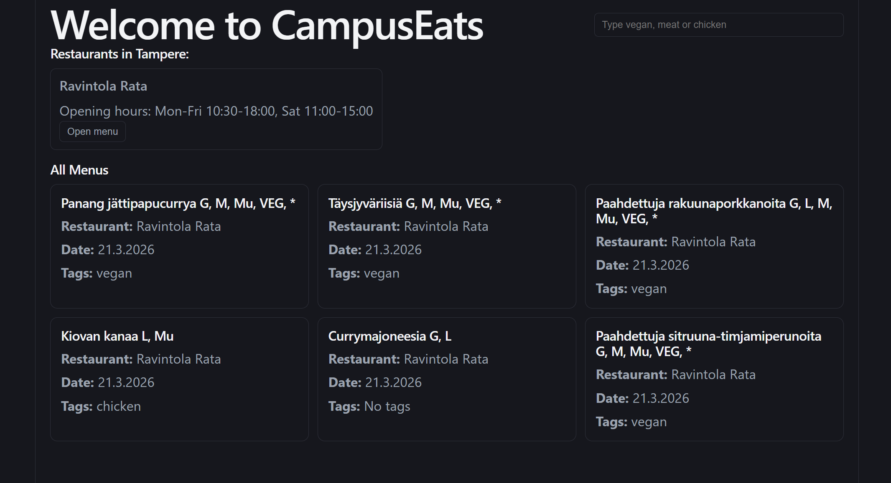

# CampusEats rel1.0.0

CampusEats is a fullstack web app for browsing campus restaurant menus with food tags.

- Fetches and displays daily menus from campus restaurants (backend: Express + MySQL + web scraper using Puppeteer)
- React + Vite frontend with tag search (vegan, meat, chicken)
- Opening hours for Ravintola Rata shown in the UI
- Users can filter menu items by tag using a top-right search bar

- Frontend: React 19, Vite, CSS
- Backend: Node.js (Express), MySQL, web scraper implemented with Puppeteer

## Running the project
1. Clone the repo
2. Install dependencies in both `backend/` and `frontend/CampusEats/`
3. Set up your MySQL database and environment variables (see backend/.env.example)
4. Start backend: `npm start` in `backend/` (default port: 3001)
5. Start frontend: `npm run dev` in `frontend/CampusEats/` (default port: 5173)
6. Open http://localhost:5173 in your browser

## Development
- Frontend in `frontend/CampusEats/src/`
- Backend in `backend/src/`

## Course Context
This repository is developed as part of the Fullstack Development course (4A00HB49-3001).

## AI use
AI was used only to clarify codes, help with ideas not to develop any codes.
AI was used in scraper.js to identify the jamix endpoints, possible keywords for filtering.

## To Be Added (Will be changed as development continues)
- [ ] All student restaurants in the Tampere area
- [ ] Admin login feature and functionality
- [ ] Better UI and UX 
- [ ] Some sort of anonymous chat between restaurants
- [ ] Mobile 
- [ ] Multi language
- [ ] Docker deployement
## Author
@samuelrooke
