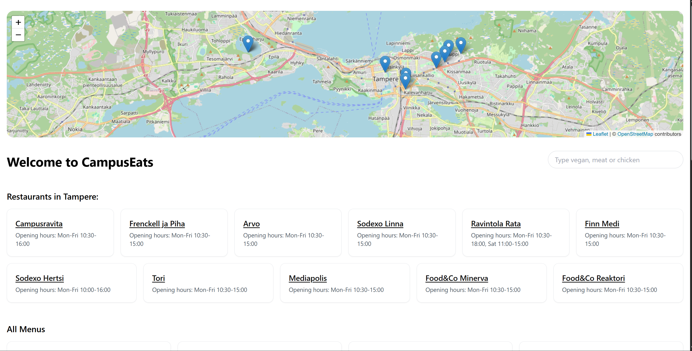

# CampusEats



Web app for browsing daily lunch menus from campus restaurants in the Tampere area. Menus are scraped every 4 hours and users can leave comments on each restaurant.

## Features

- Daily menus from 10 campus restaurants (Puppeteer scraper)
- Restaurant pages with menus and comments
- Interactive campus map with restaurant locations (Leaflet)
- Opening hours per restaurant
- Admin dashboard: manage menus, restaurants, and comments, trigger manual scrape
- JWT admin authentication

## Tech stack

| Side | Stack |
|------|-------|
| Frontend | React 19, Vite, Tailwind CSS, react-router-dom, react-leaflet |
| Backend | Node.js, Express, MySQL, Puppeteer, node-cron, jsonwebtoken |

## Project structure

```
CampusEats/
├── backend/
│   └── src/
│       ├── database/       # db connection and table init
│       └── service/        # scraper, menu, comments, restaurant logic
└── frontend/CampusEats/
    └── src/                # React components and styles
```

## Setup

**Prerequisites:** Node.js 18+, MySQL

```bash
git clone https://github.com/samuelrooke/CampusEats.git
cd CampusEats
npm install --prefix backend
npm install --prefix frontend/CampusEats
```

Copy and fill in environment variables:

```bash
cp backend/.env.example backend/.env
```

`backend/.env`:

```
DB_HOST=localhost
DB_USER=your_db_user
DB_PASSWORD=your_db_password
DB_NAME=campuseats
DB_CONNECTION_LIMIT=10
PORT=3001
JWT_SECRET=your_secret_key
ADMIN_USER=admin
ADMIN_PASS=your_admin_password
```

Database tables are created automatically on first startup.

```bash
npm start
```

Starts backend (port 3001) and frontend (port 5173). Open [http://localhost:5173](http://localhost:5173).

## Supported restaurants

| Restaurant | Scraper type |
|------------|-------------|
| Campusravita | Juvenes / Jamix API |
| Frenckell ja Piha | Juvenes / Jamix API |
| Arvo | Juvenes / Jamix API |
| Sodexo Linna | Sodexo |
| Ravintola Rata | Juvenes / Jamix API |
| Finn Medi | Pikante |
| Sodexo Hertsi | Sodexo |
| Tori Mediapolis | Juvenes / ISS |
| Food&Co Minerva | Compass |
| Food&Co Reaktori | Compass |

## API routes

| Method | Route | Auth | Description |
|--------|-------|------|-------------|
| GET | `/api/health` | | Health check |
| GET | `/api/menus` | | Today's menus |
| GET | `/api/comments/:restaurantId` | | Comments for a restaurant |
| POST | `/api/comments` | | Add a comment |
| POST | `/api/login` | | Admin login, returns JWT |
| GET | `/api/admin/comments` | admin | All comments |
| DELETE | `/api/comments/:id` | admin | Delete a comment |
| GET | `/api/admin/restaurants` | admin | All restaurants |
| PUT | `/api/restaurants/:id` | admin | Update a restaurant |
| DELETE | `/api/restaurants/:id` | admin | Delete a restaurant |
| DELETE | `/api/menus/:id` | admin | Delete a menu item |
| POST | `/api/menus/refresh` | admin | Trigger manual scrape |

## Roadmap

- [x] Daily menu scraping (10 restaurants)
- [x] Interactive campus map
- [x] User comments per restaurant
- [x] Admin dashboard with CRUD and manual refresh
- [x] JWT admin authentication
- [x] Better UI/UX
- [ ] Mobile layout
- [ ] Multi-language support
- [ ] Docker deployment

## Course context

Developed as part of the Fullstack Development course (4A00HB49-3001).

## Author

[@samuelrooke](https://github.com/samuelrooke)
