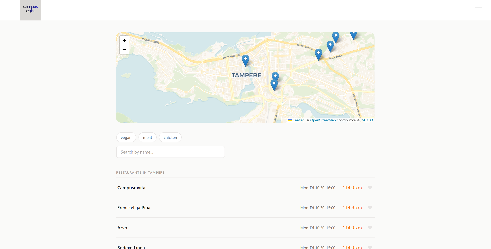
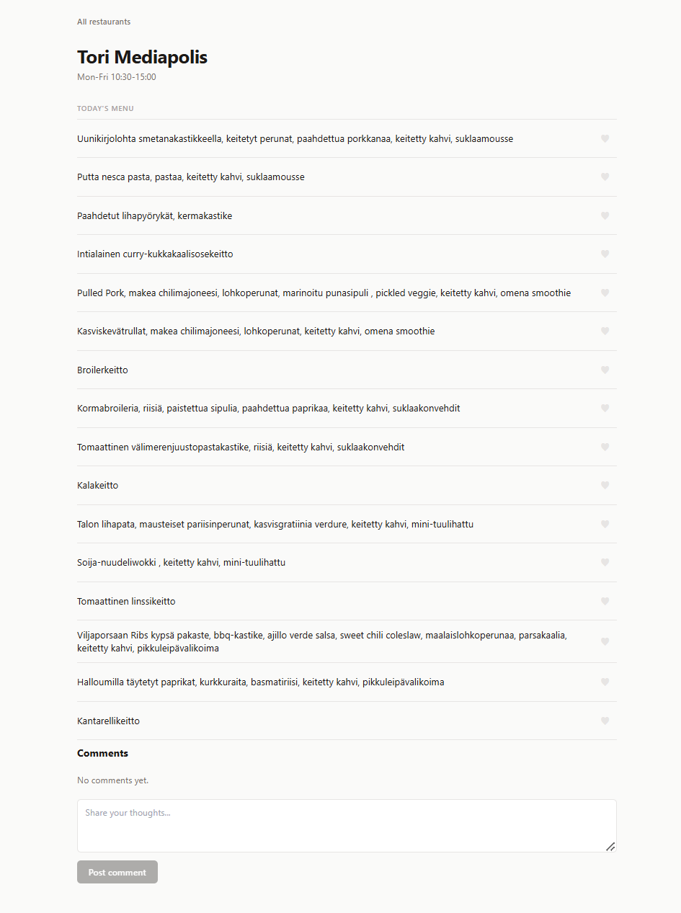
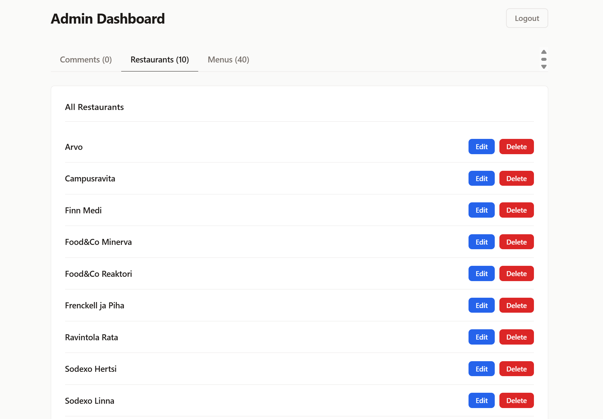
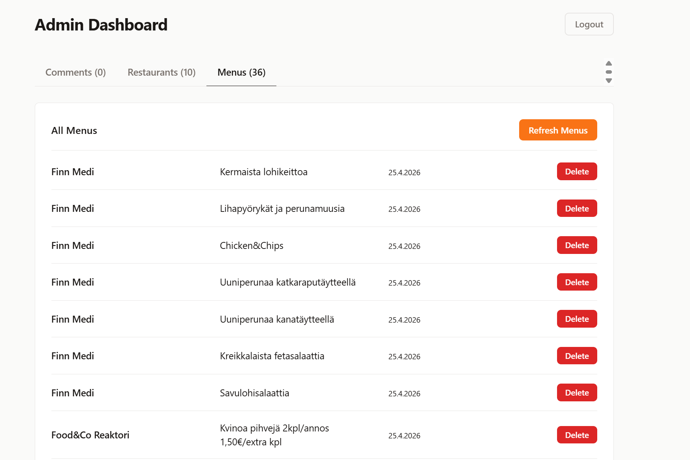
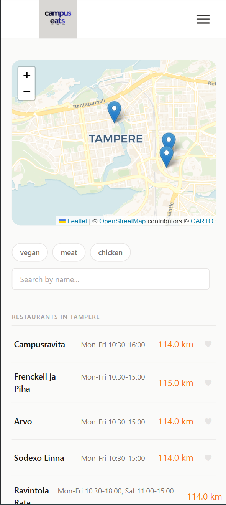
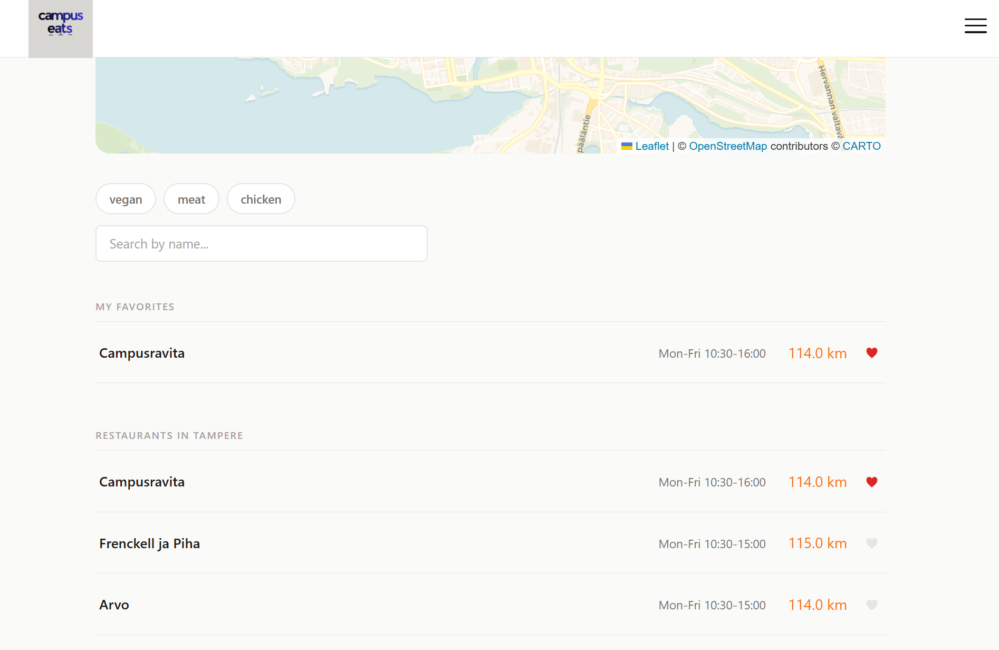
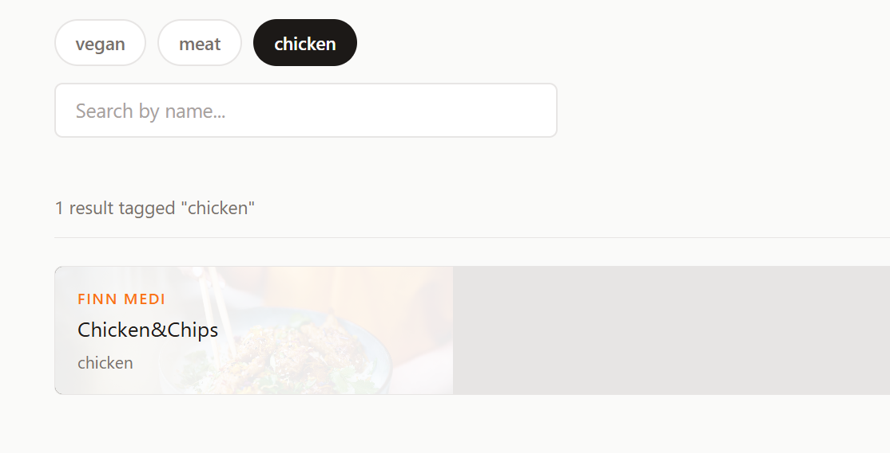
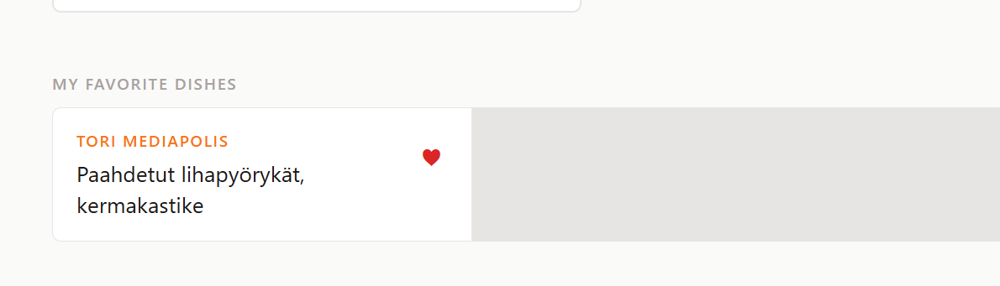

# CampusEats

Web app for browsing daily university lunch menus from the Tampere area. Menus are scraped every 4 hours and users can leave comments on each restaurant.

Live: https://campuseats-a2ww.onrender.com
Screencast: https://youtu.be/IgZ6iAv06ag

## Screenshots

### Home page


### Restaurant page


### Admin dashboard


### Admin dashboard menus


### Mobile view


### Favorites


### Search and tag filtering


### Favorite dishes


## Features

- Daily menus from 10 campus restaurants scraped with Puppeteer
- Restaurant pages with menus and comments
- Interactive campus map with restaurant locations (Leaflet)
- Favorite restaurants and dishes saved to localStorage
- Opening hours per restaurant
- Food tag filtering and text search
- Admin dashboard with CRUD and manual scrape trigger
- JWT admin authentication

## Tech stack

| Side | Stack |
|------|-------|
| Frontend | React 19, Vite, react-router-dom, react-leaflet |
| Backend | Node.js, Express, MySQL, Puppeteer, node-cron, jsonwebtoken |
| Infra | Docker, Docker Compose, npm workspaces |
| Hosting | Render (app), Railway (MySQL) |

## Project structure

```
CampusEats/
├── backend/
│   └── src/
│       ├── database/       # db connection and table init
│       └── service/        # scraper, menu, comments, restaurant logic
└── frontend/CampusEats/
    └── src/                # React components and styles
```

## Local development

**Prerequisites:** Node.js 20+, MySQL

```bash
git clone https://github.com/samuelrooke/CampusEats.git
cd CampusEats
npm install
cp backend/.env.example backend/.env
```

Fill in `backend/.env`:

```
DB_HOST=localhost
DB_PORT=3306
DB_USER=your_db_user
DB_PASSWORD=your_db_password
DB_NAME=campuseats
DB_CONNECTION_LIMIT=10
PORT=3001
JWT_SECRET=your_secret_key
ADMIN_USER=admin
ADMIN_PASS=your_admin_password
```

Database tables are created automatically on first startup.

```bash
npm run dev
```

Starts backend on port 3001 and frontend dev server on port 5173.

## Tests

```bash
npm test -w backend
```

22 Jest + Supertest tests covering all 14 API routes.

## Supported restaurants

| Restaurant | Scraper |
|------------|---------|
| Campusravita | Jamix API |
| Frenckell ja Piha | Jamix API |
| Arvo | Jamix API |
| Sodexo Linna | Sodexo |
| Ravintola Rata | Jamix API |
| Finn Medi | Pikante |
| Sodexo Hertsi | Sodexo |
| Tori Mediapolis | ISS |
| Food&Co Minerva | Compass |
| Food&Co Reaktori | Compass |

## API routes

| Method | Route | Auth | Description |
|--------|-------|------|-------------|
| GET | `/api/health` | | Health check |
| GET | `/api/menus` | | Today's menus |
| GET | `/api/comments/:restaurantId` | | Comments for a restaurant |
| POST | `/api/comments` | | Add a comment |
| POST | `/api/login` | | Admin login, returns JWT |
| POST | `/api/logout` | admin | Logout |
| GET | `/api/admin/comments` | admin | All comments |
| DELETE | `/api/comments/:id` | admin | Delete a comment |
| GET | `/api/admin/restaurants` | admin | All restaurants |
| PUT | `/api/restaurants/:id` | admin | Update a restaurant |
| DELETE | `/api/restaurants/:id` | admin | Delete a restaurant |
| DELETE | `/api/menus/:id` | admin | Delete a menu item |
| POST | `/api/menus/refresh` | admin | Trigger manual scrape |

## Course context

Developed as part of the Fullstack Development course (4A00HB49-3001).

## AI use

AI (Claude, Gemini, ChatGPT Research, Learn, Study Mode) was used in the following areas:

- **Scraper**: used as a reference when reverse-engineering undocumented restaurant APIs and figuring out site-specific HTML structures
- **Bug fixing**: used as a debugging aid for environment-specific issues that were difficult to reproduce locally
- **Docker**: consulted when learning how to containerise a Node.js app with Puppeteer and set up a multi-container environment
- **Testing**: asked how to implement test environments from earlier assignments to this project, used AI to add inline comments to code making it easier to navigate during development
- **Styling**: used as a reference for CSS patterns and layout ideas eg. asking what is usually used for menus, are they grids or how to design frontpage or restaurant page
- **Code clarification**: used to better understand libraries and concepts encountered during development
- **Pull request summaries**: GitHub Copilot was used to generate PR descriptions

Architecture and design decisions (database schema, API structure) were discussed with AI, implementation were done only by me.

## Author

[@samuelrooke](https://github.com/samuelrooke)
